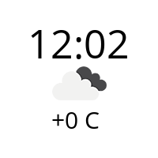

# TG_Avatar #

## Description ##

This script updates you avatar in Telegram every minute with adding time and weather data (weather icon and temperature) on it using Telegram API. Weather data getting from OpenWeatherMap API and updates every 10 minutes.
If all works fine, you will see something like that:

## Getting Started ##

Before launching the script you should do some steps.

1. Telegram API

Get you own Telegram app api_id and app api_hash by following [this](https://core.telegram.org/api/obtaining_api_id) instruction.
Write them to <`config.py`> file with you phone number and password by adding corresponding values to variables.

2. OpenWeatherMap API

Get you own OpenWeatherMap API key from [there](https://openweathermap.org/api). Note that you should create an account first.
Write it to the <`openweather_api_key`> variable in <`config.py`>. Then found youre city's id at openweathermap.org and write it to the <`openweather_api_cityid`> variable.

3. Installing requirements

To instaling requirement modules execute this commant in shell while located in TG_Avatar base directory:

	pip install -r requirements.txt

## Customization ##

You can set text and background color by changing corresponds values in <`config.py`> file in block "customization".
Note that values must be tuples of three ints (RGB format).

## Files and folders description ##

* AvatarGenerator.py - basic class for requesting weather data and generate avatar image;
* main.py - main file, you must launch it;
* config.py - settings that contains Telegram API, OpenWeatherMap API and customization constants;
* Avatar.png - example of avatar image;
* requirements.txt - list of requirement python modules;
* OpenSans-Regular.ttf - font file;
* API_Icons - folder there OpenWeatherMap API icons collects;

## License ##

	"THE BEERWARE LICENSE" (Revision 42):
	Andrey Bibea wrote this code. As long as you retain this 
	notice, you can do whatever you want with this stuff. If we
	meet someday, and you think this stuff is worth it, you can
	buy me a beer in return.